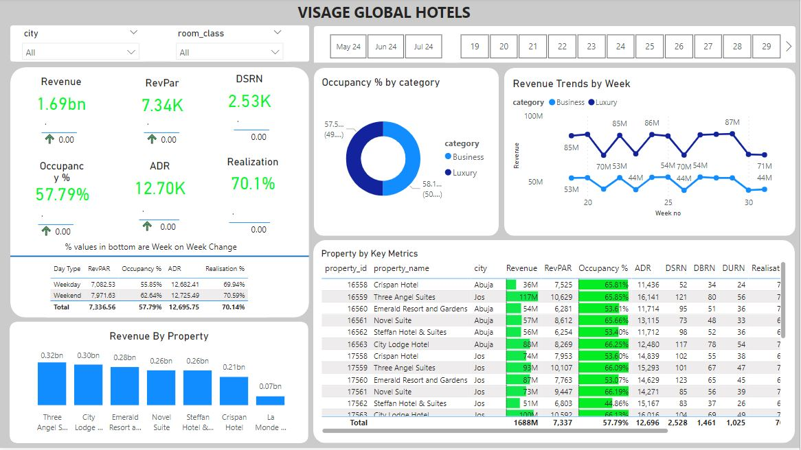
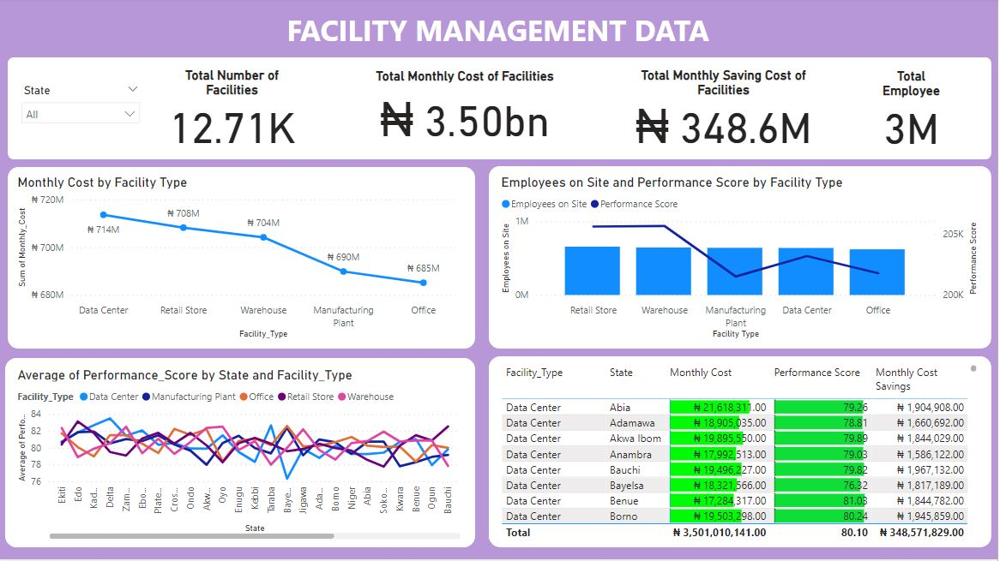
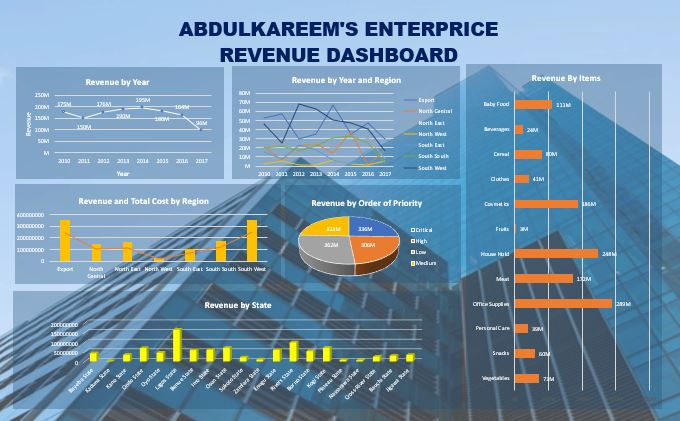

<!--Section 1: Introduce your self-->
## ABOUT ME

Hello! I'm Calvin Ugbedeojo Adejoh 🤓, a Data Analyst and a Business Analyst, with a passion for turning data into actionable insights. With experience across sales, operations, finance, and customer service, I help businesses solve challenges and unlock growth.

<!--Mention your top/relevant skills here - core and soft skills-->
## Skills

**- ✅ Data cleaning and transformation.**

**- ✅ Database Management.**

**- ✅ Data Wrangling.**

**- ✅ Forecasting and Predictive Analysis.**

**- ✅ Stakeholder Engagement.**

**- ✅ Market Analysis.**

<!--Section 2: List 3-4 key projects-->
## MY PROJECTS 

*A glimpse of some of the projects I've been working on.*

**Providing Insight to the Revenue Team in the Hospitality Domain.**

Visage global owns multiple five-star hotels across Nigeria. Due to strategic move from other competitors and ineffective decision making in management, Visage global were losing their market share and revenue in the luxury/business hotels category. So, the revenue management team hired me to provide them with insights from their historical data. 

[Read More](https://www.linkedin.com/pulse/predictive-modeling-hypothesis-testing-using-titanic-dataset-anietie/)

**Facility Management Data.**

An organization with facilities in several states in Nigeria needed insights on perfomance level and running cost of maintenance on all their facilities.So I analyzed their data and provided the value they seek.

[Read More](https://www.linkedin.com/pulse/predictive-modeling-hypothesis-testing-using-titanic-dataset-anietie/)

**Sales, Revenue and Profit Dashboarding.**

During my internship role as a business analyst at Abdulkareem's Enterprice, as one of my key responsiblities I was always charged with visualizing the sales, revenue and profit data set while also making prensentation to the stakeholders.

<a href="17 How to Present Data to Executives by Anietie Etuk.pdf">Download the Report here (pdf file)</a>

## CONTACT DETAILS

*Let’s connect and see how we can make a difference together!*
<table>
  <tbody>
    <tr>
      <td>📧</td>
      <td><a href="mailto:anietieetuk@gmail.com">anietieetuk@gmail.com</a></td>
    </tr>
    <tr>
      <td>📞</td>
      <td>(234) 816-763-7212</td>
    </tr>
    <tr>
      <td>📍</td>
      <td>PH, Nigeria</td>
    </tr>
    <tr>
      <td>⬇️</td>
      <td><a href="https://etuk123456.github.io/portfolio1/docs/Profile.pdf">Download my CV</a></td>
    </tr>
    <tr>
      <td>🌐</td>
      <td><a href="https://linkedin.com/in/etukanietie">The things I do daily on LinkedIn</a></td>
    </tr>
    <tr>
      <td>📺</td>
      <td><a href="https://www.youtube.com/@LearnwithEtuk">Watch my tutorials on YouTube</a></td>
    </tr>
  </tbody>
</table>

   

Raw File by Anietie Etuk.txt
Displaying Raw File by Anietie Etuk.txt.
